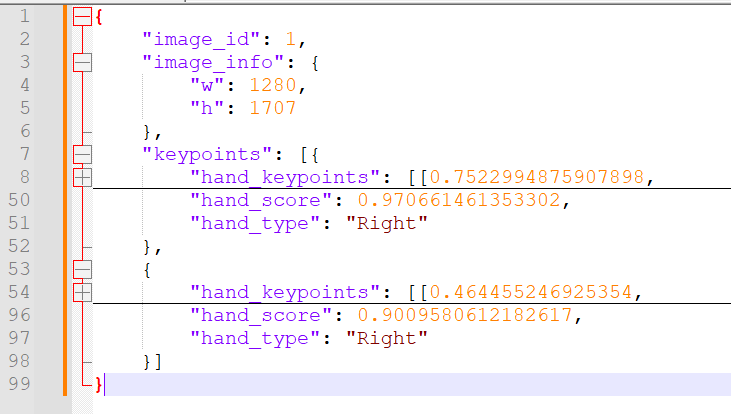

# Introdution to Project

这个项目是用来将MediaPipe的预测结果转换成指定格式的json，以便于用于数据集的形成和其他模型的训练。

---

## Folder Structure

整个项目的文件夹结构解释如下：

```
├─model
├─input
├─output
├─utils
   ├─__init__.py
   ├─mediapipe2data.py
   ├─labelme2data.py
├─demo.ipynb
└─readme.md
```

1. image文件夹存放测试图片
2. model文件夹存放MediaPipe测试模型
3. mediapipe2data.py文件可以转换mediapipe的输出
4. labelme2data.py文件可以转换labelme的输出
5. demo.ipynb展示代码用法
6. 为了代码的简洁，并未上传input，output文件夹

---

## The Content of Json File

`image_id`：一个Json文件对应着一张图片，也即一个对应的 `image_id`。

 `image_info`保存着对应图片的宽 `w`，高 `h`信息。

`keypoints`保存每只手的关键点信息，具体内容如下所示：

* `hand_keypoints`保存关键点的坐标 `<x,y>`。注意此处的坐标是归一化之后的坐标，以像素为单位。
* `hand_score`中是手的置信度。
* `hand_type`标志着是左手还是右手。

  
